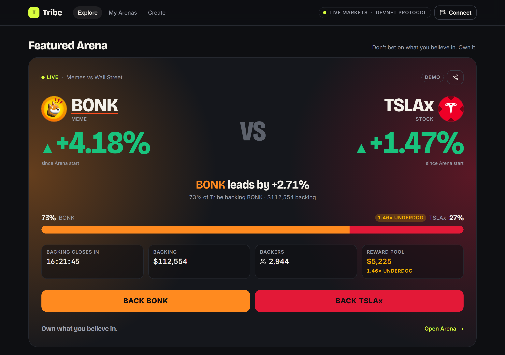
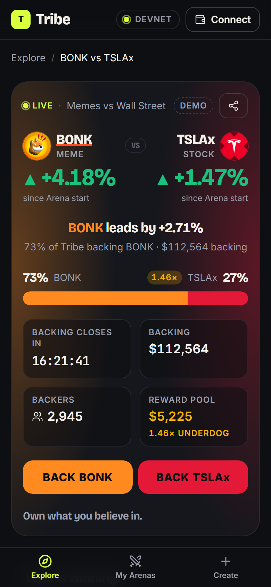
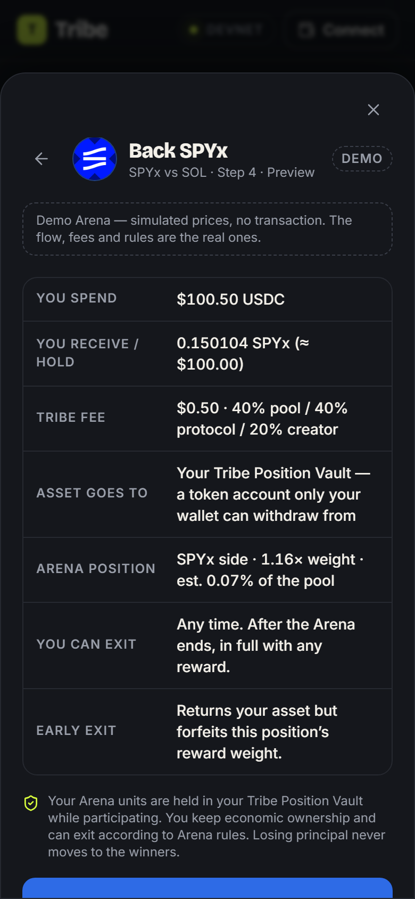
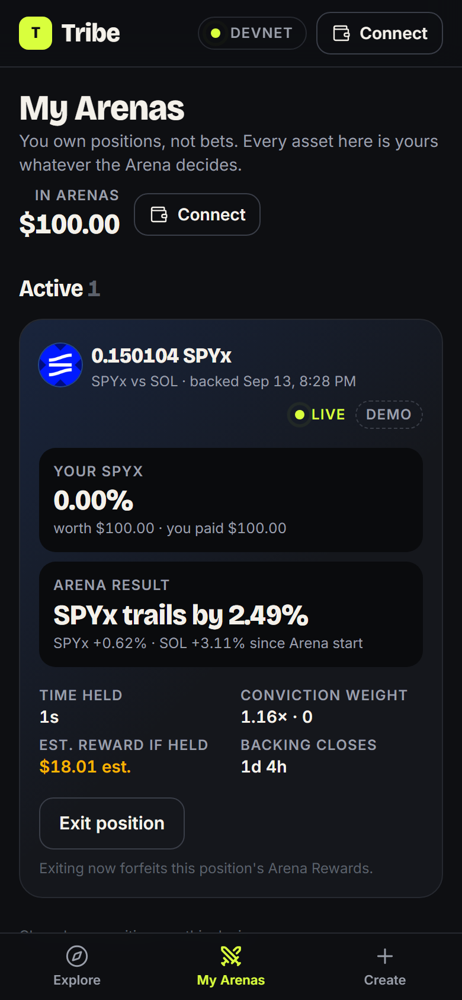

<p align="center">
  
</p>

<h1 align="center">Tribe</h1>

<p align="center"><strong>Don't bet on what you believe in. Own it.</strong></p>

<p align="center">
  A competitive ownership layer for markets on Solana.<br/>
  Built for the Solana Foundation <a href="https://x.com/solana/status/2098403597004263760">Stocklana</a> hackathon.
</p>

---

## What Tribe is

Tribe puts two real assets in an **Arena** — BONK vs TSLAx, SOL vs SPYx,
GLDx vs BTC — and lets you **Back** the one you believe in for a fixed time
window.

When you back BONK with 100 USDC, your USDC is swapped into **actual BONK**
that you own. The Arena compares each side's percentage move from the
start. The winning side shares an **Arena Reward Pool** funded by fees and
sponsors, weighted by how much you backed, how long you held, and whether
you backed the underdog.

**Tribe is not a prediction market.** Losing an Arena never transfers your
principal to anyone. Your BONK is still your BONK: keep it, sell it, or
roll it into the next Arena.

| You back BONK with $100 | BONK | TSLAx | Arena      | Your BONK is worth | Arena Rewards          |
| ----------------------- | ---- | ----- | ---------- | ------------------ | ---------------------- |
|                         | +15% | +2%   | BONK wins  | ≈ $115             | your share of the pool |
|                         | +5%  | +9%   | BONK loses | ≈ $105             | none                   |
|                         | −10% | −12%  | BONK wins  | ≈ $90              | your share of the pool |

## How it works

1. **Back** a side with USDC (routed through Jupiter into the asset) or
   with an asset balance you already hold.
2. **Own** it. Your units sit in an Arena Position Vault only you can
   withdraw from — the program has no other path for your tokens.
3. **Hold** your conviction. Reward weight is the integral of capital over
   time; backing closes before the end so nobody can snipe.
4. **Earn** if your side wins: `capital × time held × underdog multiplier`
   decides your share of the pool. Then **Victory Roll** it into more of the
   asset or the next Arena.

Details: [PRODUCT](docs/PRODUCT.md) · [ECONOMICS](docs/ECONOMICS.md) ·
[ARENA_STATE_MACHINE](docs/ARENA_STATE_MACHINE.md).

## Why Solana

Tokenized stocks (xStocks) and Solana memes share one wallet, one settlement
layer, one router. "BONK vs TSLAx" can only exist here:

- **xStocks** are Token-2022 assets with on-chain rebasing multipliers and
  Pyth/Chainlink oracle mappings — Tribe reads the multiplier straight from
  the mint so splits and dividends are price-continuous.
- **Jupiter** routes USDC into either side and returns composable
  instructions, so _swap + back_ is one signature.
- **Pyth** pull oracles let the program verify crypto **and** US-equity
  settlement prices at exact timestamps — anyone can settle an Arena and
  get the same answer.

## Architecture

```
Next.js 16 app ──▶ API routes (Jupiter, Pyth proxy, registry, OG cards)
       │                 │
       │ wallet txs      │ crank + indexer
       ▼                 ▼
 tribe_arena (Anchor 1.2) ◀── Pyth receiver ── Pyth Hermes
   Arena · Position vaults (Token-2022 aware) · Reward pool · Registry
```

- **On-chain**: Arena state, position vaults, time-weighted accumulators,
  reward pool, sponsor deposits, Pyth-verified settlement, claims,
  permissionless start / settle / cancel-on-expiry.
- **Off-chain**: indexer (Postgres), crank, price SSE, market-quality
  scoring, leaderboards, Conviction Score, social cards.
- **Custody model**: per-user Arena Position Vault with user-only
  withdrawal — chosen over delegation and balance snapshots because it is
  the only option that lets Tribe _honestly_ attest holding duration. See
  [ARCHITECTURE](docs/ARCHITECTURE.md#4-custody-and-holding-verification).

Full document: [ARCHITECTURE](docs/ARCHITECTURE.md) ·
[SECURITY](docs/SECURITY.md) · [DESIGN_SYSTEM](docs/DESIGN_SYSTEM.md).

## Integrations

|                                                                                           | Used for                                                                                                                                |
| ----------------------------------------------------------------------------------------- | --------------------------------------------------------------------------------------------------------------------------------------- |
| [xStocks public API](https://docs.xstocks.fi/apis/openapi)                                | asset list, mints, market status, multipliers, corporate actions, oracle mapping                                                        |
| [Jupiter](https://developers.jup.ag)                                                      | quotes (`swap/v2/order`), composable swap instructions (`swap/v2/build`), Price v3, Tokens v2 (organic-volume and verification signals) |
| [Pyth](https://docs.pyth.network)                                                         | settlement and display prices; `PriceUpdateV2` verified on-chain via the Pyth Solana receiver                                           |
| Token-2022                                                                                | xStocks `ScaledUiAmount`, `pausable`, `permanentDelegate` handling via `token_interface`                                                |
| [DN Institute wash-trading study](https://github.com/mkzung/solana-xstocks-wash-analysis) | methodology for the market-quality layer                                                                                                |

## Screenshots

| Explore (desktop)                                | Arena (mobile)                                 | Back preview                                                 | My Arenas                                              |
| ------------------------------------------------ | ---------------------------------------------- | ------------------------------------------------------------ | ------------------------------------------------------ |
|  |  |  |  |

The app runs a deliberate hybrid during the hackathon: **live mainnet
market data** (Jupiter, xStocks, Pyth) next to the **Tribe program on
devnet**, plus clearly marked **demo** Arenas. Every Arena, price and
position carries a LIVE / DEVNET / DEMO badge. See
[FRONTEND](docs/FRONTEND.md).

## Repository

```
apps/web/                 Next.js app (UI, API routes, crank, indexer)
packages/core/            Pure TypeScript domain logic + shared test vectors
packages/program-client/  Generated IDL types and transaction builders
programs/tribe_arena/     Anchor program and tests
docs/                     Source-of-truth documents
scripts/                  Registry sync, seeding, crank runner
```

## Local setup

Requirements: Node 22, pnpm 12 (`corepack enable`), and for the program:
Rust, Agave CLI 4.2, Anchor 1.2 (built in WSL on Windows).

```bash
pnpm install
cp .env.example apps/web/.env.local   # optional — the defaults run keyless
pnpm dev                              # http://localhost:3000
```

Open `/` (Explore), `/arena/bonk-vs-tslax` (featured Arena), `/my-arenas`.
No wallet, faucet or cluster switch is needed to understand the product;
devnet transactions need a Solana wallet on devnet (see FRONTEND §5).

Program (WSL Ubuntu 24.04 / Linux / macOS — see
[RESEARCH_NOTES §8](docs/RESEARCH_NOTES.md#8-program-toolchain-findings-phase-2-verified-2026-09-13)):

```bash
scripts/wsl-toolchain.sh                          # Rust, Agave 4.2, Anchor 1.2 (once)
scripts/build-program.sh                          # fmt, clippy, vector parity, SBF build, IDL
pnpm --filter @tribe/program-client fixtures      # dumps mainnet Token-2022 for the test runtime (once)
pnpm --filter @tribe/program-client test:program  # 24 bankrun integration tests
```

## Environment variables

| Variable                                                                   | Purpose                                                                |
| -------------------------------------------------------------------------- | ---------------------------------------------------------------------- |
| `NEXT_PUBLIC_MARKET_CLUSTER`, `NEXT_PUBLIC_MARKET_RPC_URL`                 | market layer (prices, logos, balances) — mainnet-beta                  |
| `NEXT_PUBLIC_TRIBE_PROTOCOL_CLUSTER`, `NEXT_PUBLIC_TRIBE_PROTOCOL_RPC_URL` | protocol layer (tribe_arena) — devnet today, mainnet-beta later        |
| `NEXT_PUBLIC_TRIBE_PROGRAM_ID`                                             | deployed `tribe_arena` id (default: devnet deployment)                 |
| `NEXT_PUBLIC_DEVNET_ASSETS`                                                | devnet stand-in mints → mainnet asset (defaults built in)              |
| `NEXT_PUBLIC_TRIBE_MODE`                                                   | `live` (default) or `demo` (fixtures only, no external calls)          |
| `NEXT_PUBLIC_APP_URL`                                                      | absolute URL for share links and OG images                             |
| `JUPITER_API_KEY`                                                          | optional; keyless lite-api is used without it                          |
| `PYTH_HERMES_URL`, `PYTH_HERMES_API_KEY`                                   | optional; feed metadata is public, price updates need a key            |
| `XSTOCKS_API_URL`                                                          | defaults to `https://api.xstocks.fi/api/v2`                            |
| `DEVNET_FAUCET_KEYPAIR`                                                    | server-side mint authority for devnet test tokens (enables the faucet) |
| `DATABASE_URL`, `CRANK_KEYPAIR`, `HELIUS_WEBHOOK_SECRET`                   | later phases (indexer, crank)                                          |

## Testing

```bash
pnpm lint          # ESLint + Prettier check
pnpm typecheck     # tsc --noEmit across the workspace
pnpm test          # Vitest: core engine (308) + web lib/components (56) + client (10)
pnpm --filter @tribe/web test:e2e   # Playwright core paths, desktop + mobile (builds and serves on :3100)
pnpm --filter @tribe/web shots      # screenshots of every page at 360/390/430/768/1280/1600
cargo test -p tribe_arena                         # Rust engine replays the shared vectors
pnpm --filter @tribe/program-client test:program  # program integration tests (bankrun)
```

The economics have shared test vectors used by both TypeScript and Rust
(`packages/core/test-vectors/*.json`, 114 vectors), so the two
implementations are checked for bit-for-bit agreement: the TS engine
generates them, the Rust engine inside the program replays them.

## Demo mode vs live mode

Tribe never presents simulated behaviour as real. Every Arena and position
carries a provenance badge — **LIVE** (on-chain, real prices, real
transactions), **DEMO** (seeded, simulated prices, no transactions), or
**FIXTURE**. `TRIBE_MODE=demo` runs the full UI without any external API.

## Program

`programs/tribe_arena` (Anchor 1.2) holds Arena state, per-user position
vaults, time-weighted accumulators, the reward pool and Pyth-verified
settlement. Sixteen instructions: `init_config`, `set_asset`, `set_paused`,
`create_arena`, `fund_reward_pool`, `snapshot_start`, `open_position`,
`back`, `exit`, `settle`, `claim`, `cancel_arena`, `cancel_expired`,
`extend_settlement`, `refund_sponsor`, `sweep_unclaimed`. Start, settle and
cancel-on-expiry are permissionless; principal only ever moves back to its
owner. Details: [ARCHITECTURE §8](docs/ARCHITECTURE.md#8-program-design-anchor-12-tribe_arena--implemented-in-phase-2)
and [SECURITY §4](docs/SECURITY.md#4-program-security-review-phase-2-programstribe_arena).

|            |                                                                                                                                                                                                                                      |
| ---------- | ------------------------------------------------------------------------------------------------------------------------------------------------------------------------------------------------------------------------------------ |
| Program id | `shzfcWWZtWWTMfRuEvdBAsJZUe3mYork3wug5z5U5w4`                                                                                                                                                                                        |
| Cluster    | devnet — deployed 2026-09-13, tx [`4PGtEY2x…`](https://explorer.solana.com/tx/4PGtEY2xfZJYkfCFfCQLVUca5Ush573mHoYHxoZvJCDeBfAWodseY1rsMWHjnxqssJjsMHcxApURBCuR7SANiuvU?cluster=devnet); record in [DEPLOYMENTS](docs/DEPLOYMENTS.md) |
| Client     | `packages/program-client` — PDAs, instruction builders, fetchers, `open+back` and swap-then-back composition                                                                                                                         |

Mainnet deployment is deliberately not part of Phase 2.

## Status

Phase 0 (architecture and product lock), Phase 1 (core economic engine:
`packages/core`, 308 tests, 114 shared test vectors), Phase 2 (Anchor
program with Rust engine parity, 24 integration tests, typed client, devnet
deployment) and Phase 3 (consumer app: Explore, Arena, Back flow, My
Arenas; live mainnet market data; a live devnet Arena) complete. Phase 4
(mainnet readiness): Arena reference prices moved to Q10, wSOL Backs and the
two-step Jupiter → Back flow implemented; the Q10 program build awaits its
devnet regression redeploy, and mainnet deployment is gated on review
([MAINNET_CUTOVER](docs/MAINNET_CUTOVER.md)). See
[STOCKLANA_PLAN](docs/STOCKLANA_PLAN.md) for phases, the demo script, and
open decisions. Known limitations are listed in
[SECURITY §6](docs/SECURITY.md#6-known-limitations-documented-in-readme).

## Hackathon context

Stocklana, Solana Foundation — _"Tokenized stocks already trade on Solana.
Build what makes owning and using them better than today's brokerage
app."_ Tribe's wedge: **Consumer** — a social reason to own tokenized
stocks and memes side by side, with real ownership at the core.

Open-source components: Anchor, Pyth SDKs, Jupiter APIs, Radix UI, Motion,
Tailwind, Drizzle, and others listed in `package.json`. All Tribe code is MIT
licensed.
